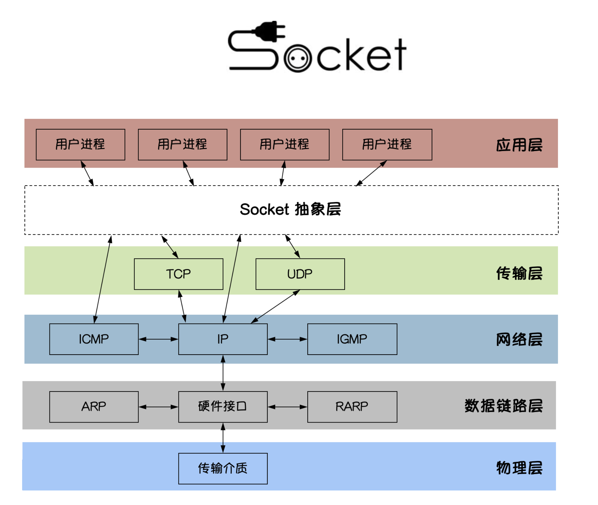
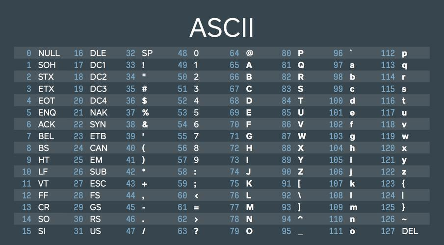
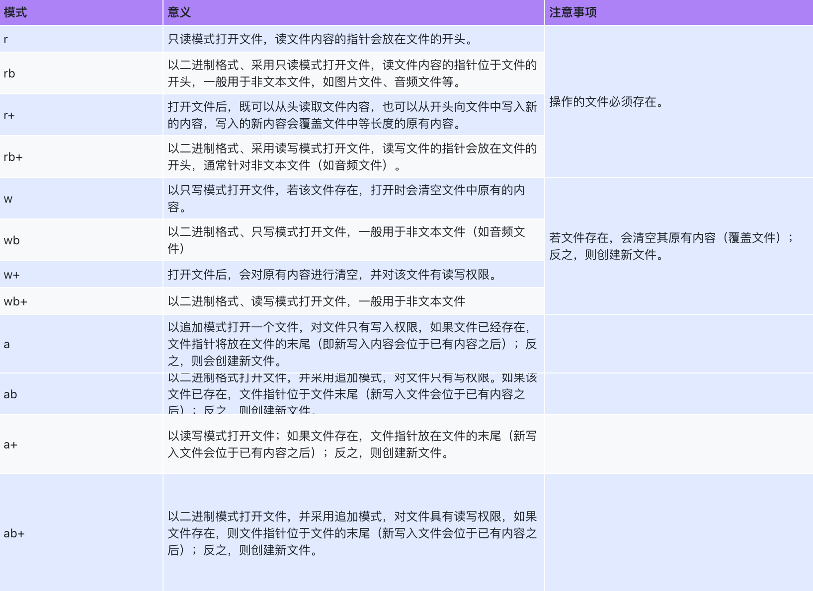

# JS逆向SVIP8期

# 第一篇：爬虫核心语法

## 1.1、爬虫预备


### 1、WEB开发

#### 【1】最简单的web应用程序



```golang
import socket

sock = socket.socket()
sock.bind(("127.0.0.1", 8000))
sock.listen(3)

print("服务器已经启动...")
while 1:
    conn, addr = sock.accept()
    data = conn.recv(1024)
    print("data:", data)
    conn.send(b"HTTP/1.1 200 ok\r\n\r\nhello yuan")
    conn.close()
```

> 基于postman完成测试！

#### 【2】基于flask搭建web网站

```python
from flask import Flask, render_template

app = Flask(__name__, template_folder="templates")


@app.get("/index")
def index():
    return render_template("index.html")


@app.get("/timer")
def timer():
    import datetime

    now = datetime.datetime.now().strftime("%Y-%m-%d %X")
    return render_template("timer.html", **{
        "now": now
    })


app.run()

```

### 2、HTTP协议

HTTP协议是Hyper Text Transfer Protocol（超文本传输协议）的缩写,是用于万维网（WWW:World Wide Web ）服务器与本地浏览器之间传输超文本的传送协议。HTTP是一个属于应用层的面向对象的协议，由于其简捷、快速的方式，适用于分布式超媒体信息系统。它于1990年提出，经过几年的使用与发展，得到不断地完善和扩展。HTTP协议工作于客户端-服务端架构为上。浏览器作为HTTP客户端通过URL向HTTP服务端即WEB服务器发送所有请求。Web服务器根据接收到的请求后，向客户端发送响应信息。


#### 【1】http协议特性

* 基于TCP/IP协议

* 基于请求－响应模式

* 无状态保存

* 短连接和长连接

  HTTP1.0默认使用的是短连接。浏览器和服务器每进行一次HTTP操作，就建立一次连接，任务结束就中断连接。
  HTTP/1.1起，默认使用长连接。要使用长连接，客户端和服务器的HTTP首部的Connection都要设置为keep-alive，才能支持长连接。
  HTTP长连接，指的是复用TCP连接。多个HTTP请求可以复用同一个TCP连接，这就节省了TCP连接建立和断开的消耗。

#### 【2】http请求协议与响应协议

http协议包含由浏览器发送数据到服务器需要遵循的请求协议与服务器发送数据到浏览器需要遵循的请求协议。用于HTTP协议交互的信被为HTTP报文。请求端(客户端)的HTTP报文 做请求报文,响应端(服务器端)的 做响应报文。HTTP报文本身是由多行数据构成的字文本。

* 一个完整的URL包括：协议、ip、端口、路径、参数  （lagou网）
* 请求方式: get与post请求

请求协议格式：


响应协议格式：


#### 【3】get请求和post请求

HTTP 协议是用于在客户端（如浏览器）和服务器之间传输数据的协议。它定义了多种请求方法，其中最常用的两种是 **GET** 和 **POST** 请求。以下是对这两种请求的详细介绍：

GET 请求

- **定义**：GET 请求用于从服务器获取数据。它是无副作用的，即不会对服务器上的资源产生改变。
- 特点：
  - **参数传递**：请求参数通常附加在 URL 中，通过 `?` 和 `&` 分隔。例如：`https://example.com/api?name=John&age=30`。
  - **限制**：URL 的长度有限制，这通常取决于浏览器和服务器，实现上大约为 2000 字符，因此不适合传递大量数据。
  - **安全性**：因为参数在 URL 中明文显示，所以 GET 请求不适合传递敏感信息（如密码）。

POST 请求

- **定义**：POST 请求用于向服务器发送数据，通常用于创建或更新资源。
- 特点：
  - **参数传递**：请求参数包含在请求体中，而不是 URL 中。这使得可以传递大量数据。
  - **灵活性**：可以处理多种类型的数据，比如 JSON、XML、表单数据等。
  - **安全性**：虽然 POST 请求比 GET 请求更安全（因为数据不暴露在 URL 中），但仍需通过 HTTPS 进行加密，以保护敏感信息。

#### 【4】响应html


#### 【5】响应json

基本概念与语法

> 序列化是将数据结构或对象转换为字节流（二进制数据）以便存储或传输
>
> 反序列化是将字节流还原为原始数据结构或对象的过程。

序列化最重要的就是json序列化。

JSON(JavaScript Object Notation, JS 对象标记) 是一种轻量级的数据交换格式。简洁和清晰的层次结构使得 JSON 成为理想的数据交换语言。 易于人阅读和编写，同时也易于机器解析和生成，并有效地提升网络传输效率。

```vb
+-------------------+---------------+
| Python            | JSON          |
+===================+===============+
| dict              | object        |
+-------------------+---------------+
| list, tuple       | array          |
+-------------------+---------------+
| str               | string        |
+-------------------+---------------+
| int, float        | number        |
+-------------------+---------------+
| True              | true          |
+-------------------+---------------+
| False             | false         |
+-------------------+---------------+
| None              | null          |
+-------------------+---------------+
```

`json`模块是Python标准库中的一个模块，用于处理JSON（JavaScript Object Notation）数据。它提供了一组函数来解析和生成JSON数据，使得在Python中处理JSON变得非常方便。

```python
import json

# 序列化 ：将本语言支持的高级数据对象转为json格式字符串的过程

num = 3.14
name = 'yuan'
l = [1, 2, 3]
t = (4, 5, 6)
d = {'name': "yuan", 'age': 18, "is_married": False, "gf": None}

print(repr(json.dumps(num)))  # '3.14'
print(repr(json.dumps(name)))  # '"yuan"'
print(repr(json.dumps(l)))  # '[1, 2, 3]'
print(repr(json.dumps(t)))  # '[4,5,6]'
print(repr(json.dumps(d)))  # '{"name":"yuan","age":18,"is_married":false,"gf":null}'

# 存储和传输

# 反序列化：将json格式字符串转为本语言支持的数据对象格式
# 案例1
d = {'name': "yuan", 'age': 18, "is_married": False, "gf": None}

json_d = json.dumps(d)
print(json_d, type(json_d))

data = json.loads(json_d)
print(data, type(data))

name = data.get("name")
print(name)

# 案例2:

s = '{"name":"yuan","age":18,"isMarried":False}'
#  重点：反序列化前提数据得是json格式的字符串
data = json.loads(s)
print(data, type(data))

s2 = '[{"name":"yuan","age":18,"isMarried":false},{"name":"rain","age":28,"isMarried":true}]'
data2 = json.loads(s2)

print(data2,type(data2))

print(data2[1].get("name"))


# 思考：json.loads('{"name": "yuan", "age": 23, "is_married": 0}') 可以吗？
```

应用之网络传输

##### 前端

```js
// 序列化
data = {user:"yuan",pwd:123}
console.log(JSON.stringify(data)) // '{"user":"yuan","pwd":123}'

// 反序列化
res_json = '{"name": "yuan", "age": 23, "is_married": 0}'
let res = JSON.parse(res_json)
console.log(res)
```

##### 后端

```python
import json

# 反序列化
data = '{"user":"yuan","pwd":123}'
data_dict = json.loads(data)
print(type(data_dict))

# 序列化
res = {'name':'yuan','age':23,'is_married':0}
res_json = json.dumps(res)  # 序列化，将python的字典转换为json格式的字符串

print(repr(res_json)) # '{"name": "yuan", "age": 23, "is_married": 0}'
```

##### 关于ajax

```html
<script src="https://cdn.bootcdn.net/ajax/libs/jquery/3.7.1/jquery.js"></script>
<script>
    // JS代码：dom bom ecma
    dom = document.getElementsByTagName("h3")[0]
    dom.onclick = function () {
        console.log(1 + 1)
    }

    $(".books").click(function () {
        // 发送ajax请求，获取四大名著的数据
        $.ajax({
            "url": "/books",
            "type": "get",
            //"data":{}
            success: function (res) {

                console.log("res:::", res)
                 $(".books_box").append(res.join("，"))

            }
        })

    })
</script>
```

### 3. 文件操作

#### 1. 字符编码


计算机存储信息的大小,最基本的单位是字节。

* 1KB＝1024B

* 1MB＝1024KB

* 1GB＝1024MB

* 1TB＝1024GB

字符编码是将字符集中的字符映射到二进制表示形式的规则集。ASCII、GBK、Unicode和UTF-8是常见的字符编码标准。下面我将对每种编码进行简要介绍：



> 1. ASCII（American Standard Code for Information Interchange）：ASCII 是最早的字符编码标准，使用 7 位二进制数（0-127）表示 128 个常用字符，包括英文字母、数字和一些常见的符号。ASCII 编码是单字节编码，每个字符占用一个字节的存储空间。
> 2. GBK（GuoBiao/Kuòbiāo）：GBK 是中文编码标准，是国家标准 GB 2312 的扩展，支持汉字字符。GBK 使用双字节编码，其中一个字节表示高位，另一个字节表示低位，可以表示大约 21000 个汉字和其他字符。GBK 编码兼容 ASCII 编码，即 ASCII 字符可以用一个字节表示。
> 3. Unicode（统一码）：Unicode 是一种字符编码标准，旨在为全球所有的字符提供唯一的标识符。它使用固定长度的编码单元表示字符，最常见的编码单元是 16 位（如 UTF-16）。Unicode 可以表示几乎所有语言的字符。
> 4. UTF-8（Unicode Transformation Format-8）：UTF-8 是一种可变长度的 Unicode 编码标准，通过使用不同长度的字节序列来表示字符。UTF-8 是互联网上最常用的字符编码标准，因为它兼容 ASCII 编码，可以表示全球各种语言的字符。它使用 8 位字节编码，根据字符的不同范围使用不同长度的字节，ASCII 字符使用一个字节表示，而其他字符使用多个字节表示。

编码和解码是在字符编码过程中使用的两个关键概念。编码是将字符转换为特定编码标准下的二进制表示形式，而解码则是将二进制数据转换回字符形式。

在字符编码中，编码器用于将字符转换为相应编码标准下的二进制数据，而解码器用于将二进制数据转换回字符形式。编码和解码的过程是互逆的，可以通过相应的编码和解码算法进行转换。

```python
text = "Hello, 你好"

# 编码过程
encoded = text.encode('utf-8')  # 使用 UTF-8 编码将文本转换为二进制数据
print("编码后的数据:", encoded)

# 解码过程
decoded = encoded.decode('utf-8')  # 使用 UTF-8 解码将二进制数据转换为文本
print("解码后的文本:", decoded)
```

输出结果如下：

```text
编码后的数据: b'Hello, \xe4\xbd\xa0\xe5\xa5\xbd'
解码后的文本: Hello, 你好
```

> 需要注意的是，在编码和解码过程中，要确保使用相同的编码标准进行处理。否则，编码和解码的结果可能会不正确，导致乱码或数据损坏。

#### 2. 文件操作

在 Python 中，如果想要操作文件，首先需要创建或者打开指定的文件，并创建一个文件对象，而这些工作可以通过内置的 open() 函数实现。

open() 函数用于创建或打开指定文件，该函数的常用语法格式如下：

```python
def open(file, mode='r', encoding=None,): # known special case of open
```



（1）读文件

```python
file = open("example.txt", "r")  # 以只读模式打开文件
content = file.read()  # 读取整个文件内容
line = file.readline()  # 读取一行内容
lines = file.readlines()  # 读取所有行，并返回列表
file.close() # 关闭
```

（2）写文件

```python
file = open("example.txt", "w")  # 以只写模式打开文件
file.write("Hello, World!")  # 向文件写入内容
# Python 的文件对象中，不仅提供了 write() 函数，还提供了 writelines() 函数，可以实现将字符串列表写入文件中。
# file.writelines(f.readlines())
file.close() # 关闭
```

> 注意，写入函数只有 write() 和 writelines() 函数，而没有名为 writeline 的函数。

（3）with open

任何一门编程语言中，文件的输入输出、数据库的连接断开等，都是很常见的资源管理操作。但资源都是有限的，在写程序时，必须保证这些资源在使用过后得到释放，不然就容易造成资源泄露，轻者使得系统处理缓慢，严重时会使系统崩溃。

例如，前面在介绍文件操作时，一直强调打开的文件最后一定要关闭，否则会程序的运行造成意想不到的隐患。但是，即便使用 close() 做好了关闭文件的操作，如果在打开文件或文件操作过程中抛出了异常，还是无法及时关闭文件。

为了更好地避免此类问题，不同的编程语言都引入了不同的机制。在Python中，对应的解决方式是使用 with as 语句操作上下文管理器（context manager），它能够帮助我们自动分配并且释放资源。

```python
with open("example.txt", "r") as file:
    content = file.read()
    # 在这里进行文件操作，文件会在代码块结束后自动关闭
```

此外，还有其他文件操作函数和方法可供使用，例如重命名文件、删除文件等。

## 1.2、爬虫初识

### 【1】爬虫介绍

- 什么是爬虫

  - 就是通过编写程序，“模拟”浏览器上网，然后让其在互联网中“抓取”数据的过程。
    - 模拟：浏览器本身就是一个纯天然的爬虫工具。爬虫相关的操作都是模拟/基于浏览器为基础开发实现出来的。
    - 抓取：
      - 一种是抓取一张页面中所有的数据
      - 一种是抓取页面中局部的数据

  - 提问：如果日后你的爬虫程序没有爬取到你想要的数据，why？
    - **你的程序模拟浏览器的力度不够！**

- 爬虫在应用场景的分类

  - 通用爬虫：将一整张页面源码数据进行爬取。
  - 聚焦爬虫：将一张页面中局部/指定的数据进行抓取。建立在通用爬虫的基础上。

- 爬虫的矛与盾（重点）

  - 反爬机制：对应门户网站，网站可以指定相关的机制阻止爬虫对其网站数据的采集
  - 反反爬策略：对应爬虫程序，爬虫可以制定相关的策略将网站的反爬机制破解，从而爬取到指定的数据

  


### 【2】requests基础

- 基本介绍
  - requests是一个基于网络请求的模块。可以使用程序模拟浏览器上网。

- 环境安装
  - pip install requests

- 编码流程
  - 指定url（输入一个网址）
  - 发起请求（按下回车）
  - 获取响应数据（请求到的数据）
  - 持久化存储

### 【3】案例应用

#### （1）百度热搜

```python
import requests
import re
# 四要素：请求方式、url、请求头、载荷

# (1) 爬虫
url = "https://www.baidu.com/"
my_headers = {
    "user-agent": "Mozilla/5.0 (Macintosh; Intel Mac OS X 10_15_7) AppleWebKit/537.36 (KHTML, like Gecko) Chrome/130.0.0.0 Safari/537.36"
}
res = requests.get(url, headers=my_headers)
# print(res.text)

# (2) 数据解析：re/xpath
ret = re.findall('<span class="title-content-title">(.*?)</span>',res.text)
print(ret)
```

#### （2）豆瓣电影

```python
import json

import requests

tags = input("电影类型：")

url = "https://m.douban.com/rexxar/api/v2/movie/recommend"

my_params = {
    "start": 0,
    "count": 60,
    "tags": tags
}
my_headers = {
    "user-agent": "Mozilla/5.0 (Macintosh; Intel Mac OS X 10_15_7) AppleWebKit/537.36 (KHTML, like Gecko) Chrome/130.0.0.0 Safari/537.36",
    "referer": "https://movie.douban.com/explore"
}
res = requests.get(url, headers=my_headers, params=my_params)
print(res.text) # 响应体是一个页面，就没有办法用json转换
# print(json.loads(res.text).get("count"))
print(res.json()) # 响应体是json字符串，res.json()将爬虫得到的json字符串反序列化

```

#### （3）有道翻译

```python
import requests

while 1:
    wd = input("请输入翻译的单词：")
    url = "https://aidemo.youdao.com/trans"
    my_data = {
        "q": wd,
        "from": "Auto",
        "to": "Auto"
    }
    res = requests.post(url, data=my_data)
    print(res.json().get("translation")[0])

```

#### （4）东方财富首页数据爬取

```python
import requests

#1.指定url
main_url = 'https://www.eastmoney.com/'

#2.发起请求:
#get函数可以根据指定的url发起网络请求
#get函数会返回一个响应对象:
response = requests.get(url=main_url)

#设置响应对象的编码格式(处理中文乱码)
response.encoding = 'utf-8'

#3.获取响应数据
page_text = response.text #text是可以返回字符串形式的响应数据/爬取到的数据

#4.持久化存储
with open('dongfang.html','w') as fp:
    fp.write(page_text)
```

#### （5）爬取51游戏

```python
import requests

#1.指定url
game_title = input('enter a game name:')
params = { #字典是用于封装请求参数
    'q':game_title
}
url = 'https://game.51.com/search/action/game/'

#2.发起请求
    #get是基于指定的url和携带了固定的请求参数进行请求发送
response = requests.get(url=url,params=params)

#3.获取响应数据
page_text = response.text #text表示获取字符串形式的响应数据
# print(page_text)

#4.持久化存储
fileName = game_title + '.html'
with open(fileName,'w') as fp:
    fp.write(page_text)
```

#### （6）中国人事考试网---站内搜索

```python
import json

import requests

url = "https://www.icve.com.cn/portal/portal/getSchoolList"
for page in range(1,11):
    my_data = {
        "page": page
    }
    my_hearders = {
        # "user-agent": "Mozilla/5.0 (Macintosh; Intel Mac OS X 10_15_7) AppleWebKit/537.36 (KHTML, like Gecko) Chrome/130.0.0.0 Safari/537.36",
        "referer": "https://www.icve.com.cn/",
        # "cookie": "acw_tc=0a47308517317628509776770e0031ce444064f7f6b6d2473a91d62e42e0ec; verifycode=DF959100260C65EE3CC98897979660E8@638673884886501409; _abfpc=8bb710beece62b1cabdcecc2e65be003946ce24a_2.0; cna=5711e2003d00fcb462c448158353559e"
    }
    res = requests.post(url, data=my_data, headers=my_hearders)
    data = json.loads(res.json().get("list"))
    print(data)
    for i in data:
        print(i.get("Name"))

```

#### （7）图片数据爬取


### 【4】作业

1. 肯德基（POST请求、动态加载数据、UA检测）

- http://www.kfc.com.cn/kfccda/storelist/index.aspx

  - 将餐厅的位置信息进行数据爬取


    - 爬取多页数据

2. 小试牛刀：

- url：https://www.xiachufang.com/
- 实现爬取下厨房网站中任意菜谱搜索结果数据爬取

## 1.3、数据解析

### 【1】正则表达式

Regular Expression，译作正则表达式或正规表示法，表示有规则的表达式，意思是说，描述一段文本排列规则的表达式。

正则表达式并不是Python的一部分。而是一套独立于编程语言，用于处理复杂文本信息的强大的高级文本操作工具。正则表达式拥有自己独特的规则语法以及一个独立的正则处理引擎，我们根据正则语法编写好规则（模式）以后，引擎不仅能够根据规则进行模糊文本查找，还可以进行模糊分割，替换等复杂的文本操作，能让开发者随心所欲地处理文本信息。正则引擎一般由编程语言提供操作，像python就提供了re模块或regex模块来调用正则处理引擎。

正则表达式在处理文本的效率上不如系统自带的字符串操作，但功能却比系统自带的要强大许多。

最早的正则表达式来源于Perl语言，后面其他的编程语言在提供正则表达式操作时基本沿用了Perl语言的正则语法，所以我们学习python的正则以后，也可以在java，php，go，javascript，sql等编程语言中使用。

正则对字符串或文本的操作，无非是分割、匹配、查找和替换。

在线测试工具  http://tool.chinaz.com/regex/

#### 1、元字符(Metacharacters)

元字符是具有特殊含义的字符。常用的11个元字符就是正则的灵魂。

##### （1）通配符

**.**   通配符、万能通配符或通配元字符，匹配1个除了换行符\n以外任何

```python
s = "apple ape agree age amaze animate advertise a\ne"
r = re.findall("ape", s)
r = re.findall("a.e", s)
r = re.findall("a..e", s)
r = re.findall("a...e", s)
print(r)
```

##### （2）字符集

**[]**   字符集，匹配一个中括号中出现的任意原子符号

```python
s = "apple ape agree age amaze animate advertise a\ne a&e a@e a6e a9e"
r = re.findall("a.e", s)
r = re.findall("a[pgz]e", s)
r = re.findall("a[a-z]e", s)
r = re.findall("a[^a-z]e", s)
r = re.findall("a[0-9]e", s)
print(r)
```

##### （3）重复元字符

重复相关的4个元字符：**{}**、*****、**+**、**?**

* **{n,m}**：数量范围贪婪符，指定左边原子的数量范围，有{n}，{n, }, {,m}, {n,m}四种写法，其中n与m必须是非负整数
* *****  指定左边原子出现0次或多次，等同{0,}
* **+**  指定左边原子出现1次或多次，等同{1,}
* ？指定左边原子出现1次或多次，等同{0,1}

> 关键点，重复默认按贪婪匹配，可以通过在重复符右边加一个`?`取消贪婪匹配，按照非贪婪模式匹配

```python
import re

# {}:指定左边原子的可以重复的数量范围
s = "aeeee apple acre ape agree age amaze animate advertise a\ne a&e a@e a6e a9e"
r = re.findall("a.{2}e", s)
r = re.findall("a[a-z]{2}e", s)
r = re.findall("a.{3}e", s)
r = re.findall("a.{1,3}e", s)  # 优先按最大贪婪匹配3去匹配
r = re.findall("a.{1,3}?e", s)  # 取消贪婪匹配，按最小的2去匹配
r = re.findall("a.{1,}?e", s)
print(r)
# *: 指定左边原子出现0次或多次，等同{0,}
# +: 指定左边原子出现1次或多次，等同{1,}
# ?: 指定左边原子出现0次或1次，等同{0,1}
s = "aeeee apple acre ape agree age amaze animate advertise a\ne a&e a@e a6e a9e"
r = re.findall("a.*e", s)  # {0,}
r = re.findall("a.*?e", s)
r = re.findall("a[a-z      、", s)
# r = re.findall(r"a[a-z]*?e\b", s)
r = re.findall("a[a-z]+?e", s)
r = re.findall("a[a-z]?e", s)
r = re.findall("a[a-z]??e", s)
print(r)
```

> 重点理解==.*?==

##### （4）**^**和**$**

| **^** | 叫开始边界符或开始锚点符，匹配一行的开头位置 |
| ----- | :------------------------------------------- |
| **$** | 叫结束边界符或结束锚点符，匹配一行的结束位置 |

```python
import re

path = "/aaa/bbb/blog/2021/12/xxx/yyy/zzz"
reg = "/blog/[0-9]{4}/[0-9]{2}/"
ret = re.findall(reg, path)
print(ret)
path = "/blog/2021/12/"
reg = "^/blog/[0-9]{4}/[0-9]{2}/$"
ret = re.findall(reg, path)
print(ret)
```

##### （5）转义符   **\\**

正则中的转义符和Python字符串的转义符相似，两个功能

* 赋予某些普通符号特殊功能

| 元字符 | 描述                                                       |
| ------ | ---------------------------------------------------------- |
| **\d** | 匹配一个数字原子，等价于`[0-9]`。                          |
| **\D** | 匹配一个非数字原子。等价于`[^0-9]`或`[^\d]`。              |
| **\w** | 匹配一个包括下划线的单词原子。等价于`[A-Za-z0-9_]`。       |
| **\W** | 匹配任何非单词字符。等价于`[^A-Za-z0-9_]` 或 `[^\w]`。     |
| **\n** | 匹配一个换行符                                             |
| **\t** | 匹配一个制表符，tab键                                      |
| **\s** | 匹配一个任何空白字符原子，包括空格、制表符、换页符等等。   |
| **\S** | 匹配一个任何非空白字符原子。                               |
| **\b** | 匹配一个单词边界原子，也就是指单词和非单词原子符间的位置。 |
| **\B** | 匹配一个非单词边界原子，等价于 `[^\b]`                     |

```python
s = "The cat sat on the caterpillar."
reg = r"\bcat\b"  # 只匹配完整的 'cat'
r = re.findall(reg, s)
print(r)  # 输出: ['cat']

s = "encrypt JSencrypt AESencrypt  encryptData encrypt"
r = re.findall(r"\bencrypt\b", s)
print(r)
```

* 取消特殊功能符号以普通化

```python
text = """
Visit us at example.com for more information.
You can also check out our partner site: partner-site.org
Don't forget about our blog at blog-example.com!
For support, visit support.example.com.
"""

# 正则表达式匹配以 .com 结尾的域名
pattern = r'\b[a-zA-Z0-9._%+-]+\.com\b'
# 查找所有匹配项
matches = re.findall(pattern, text)
# 输出结果
print("Matched .com domains:", matches)
```

##### （6）**()**  分组与优先提取

```python
import re

# 示例文本，包含多个域名
text = """
Visit us at user@qq.com for more info.
Contact support at support@qq.com.
Also, check out admin@my163.com and info@163.com.cn.
"""
# 正则表达式匹配以 163.com 结尾的域名，但不包括后缀
pattern = r'(\b[\w.-]+)@163\.com\b'
# 查找所有匹配项
matches = re.findall(pattern, text)
# 输出结果
print("Matched 163.com domains:", matches)
```

##### （7）**｜**或

```python
# 案例1
import re

# 示例文本
text = "I like apple, banana, and orange. I also enjoy grapes."
# 正则表达式匹配 'apple'、'banana' 或 'orange'
pattern = r"apple|banana|orange"
# 查找所有匹配项
matches = re.findall(pattern, text)
# 输出结果
print("Matched fruits:", matches)
# 案例2
# 示例文本，包含多个域名
text = """
Visit us at example.com for more information.
You can also check out mysite.cn and partner-site.com.
Don't forget about blog-example.com or support@service.cn.
"""

# 正则表达式匹配以 .com 或 .cn 结尾的域名
pattern = r'\b[\w.-]+\.com\b|\b[\w.-]+\.cn\b'
pattern = r'\b[\w.-]+\.(?:com|cn)'
pattern = r'\b([\w.-]+)\.(?:com|cn)'

# 查找所有匹配项
matches = re.findall(pattern, text)

# 输出结果
print("Matched .com and .cn domains:", matches)
```

#### 2、re模块中的常用函数

`re`模块提供了一组正则处理函数，使我们可以在字符串中搜索匹配项：

| 函数        | 描述                                                         |
| ----------- | ------------------------------------------------------------ |
| **findall** | 按指定的正则模式查找文本中所有符合正则模式的匹配项，以列表格式返回结果。 |
| **search**  | 在字符串中**任何位置**查找首个符合正则模式的匹配项，存在则返回re.Match对象，不存在返回None |
| **match**   | 判定字符串**开始位置**是否匹配正则模式的规则，匹配则返回re.Match对象，不匹配返回None |
| **split**   | 按指定的正则模式来分割字符串，返回一个分割后的列表           |
| **sub**     | 把字符串按指定的正则模式来查找符合正则模式的匹配项，并可以替换一个或多个匹配项成其他内容。 |
| **compile** | `compile` 方法用于编译正则表达式模式，从而生成一个正则表达式对象。这个对象可以重用，使得在多个匹配操作中更高效。 |

##### （1）findall

```python
def findall(pattern, string, flags=0)
```

`findall()`函数返回包含所有匹配项的列表，如果找不到匹配项，则返回一个空列表。

##### （2）search

```python
def search(pattern, string, flags=0)
```

`search()`函数搜索匹配的字符串，如果匹配上则返回匹配对象re.Match。如果有多个匹配项，则仅返回匹配项的第一个匹配项，如果找不到匹配项，则返回值为None

```python
import re
# 案例1
# 示例日志内容
logs = """INFO: System started
ERROR: Could not connect to database
WARNING: Low disk space
ERROR: File not found
"""

# 正则表达式用于匹配错误信息
pattern = r'ERROR:.*'

# 使用 search 查找第一个错误信息
match = re.search(pattern, logs)
if match:
    print(f"找到的错误信息: {match.group()}")
else:
    print("未找到错误信息")
    

# 案例2
# 示例文本
text = """
服务器的 IP 地址如下：
主服务器：192.168.1.1
备用服务器：10.0.0.5
外部服务器：172.16.254.1
无效 IP：256.100.50.25 和 192.168.1.256
"""

# 正则表达式用于匹配 IPv4 地址
ip_pattern = r'\b(?:\d{1,3}\.){3}\d{1,3}\b'

# 使用 search 查找第一个 IP 地址
ip_match = re.search(ip_pattern, text)
if ip_match:
    print(f"找到的第一个 IP 地址: {ip_match.group()}")
else:
    print("未找到 IP 地址")

# 如果需要提取所有 IP 地址，可以使用 findall
all_ip_matches = re.findall(ip_pattern, text)
print(f"找到的所有 IP 地址: {all_ip_matches}")   
```

##### （3）match

```python
def match(pattern, string, flags=0)
```

`match()`函数搜索匹配的字符串开始位置，如果匹配上则返回匹配对象，如果找不到匹配项，则返回值为None

##### （4）split

```python
def split(patter, string, maxsplit=0, flags=0)
```

`split()`函数返回一个列表，对字符串进行正则分割。

```python
import re

txt = "my name is moluo"
ret = re.split("\s", txt)
print(ret)  # ['my', 'name', 'is', 'moluo']

# \s 用于匹配任意空白字符，包括空格、制表符、换行符等。
text = "Hello,     world!  \nThis is a test."
pattern = r"\s+"  # 匹配一个或多个空白字符
# 使用空白字符分隔文本
words = re.split(pattern, text)
print(words)  # 输出: ['Hello,', 'world!', 'This', 'is', 'a', 'test.']
```

可以通过指定`maxsplit`参数来控制分割的次数，例如，仅在第1次出现时才拆分字符串：

```python
import re

txt = "my  name        is    yuan"
ret = re.split("\s+", txt)
print(ret)
```

##### （5）sub和subn

````python
def sub(pattern, repl, string, count=0, flags=0)  返回匹配后的结果
def subn(pattern, repl, string, count=0, flags=0)  返回匹配后的结果和次数
````

`sub()`函数用选择的文本替换匹配:

```python
import re

txt = "my  name        is    yuan"
# ret = re.sub("\s+"," " ,txt)
ret = re.sub("\s+", " ", txt, 2)
print(ret)
```

##### （6）compile()

```py
def compile(pattern, flags=0)
```

```python
import re

re_email = re.compile(r"(?:\+86)?1[3-9]\d{9}")
ret = re_email.findall("15100649928,123@qq.com,+8613653287791,666@163.com")
print(ret)

```

如果一个正则表达式要使用几千遍，每一次都会编译，出于效率的考虑进行正则表达式的编译，就不需要每次都编译了，节省了编译的时间，从而提升效率

#### 3、正则练习

**1. 匹配 Email 地址**
 **题目**: 编写正则表达式，匹配一个标准的 Email 地址格式，例如 `user@example.com`。

 ```apl
^[a-zA-Z0-9._%+-]+@[a-zA-Z0-9.-]+\.[a-zA-Z]{2,}$
 ```

**2. 匹配电话号码**
 **题目**: 编写正则表达式，匹配中国大陆的电话号码格式，例如 `138-1234-5678` 或 `13812345678`。

 ```apl
^1[3-9]\d{9}$|^1[3-9]\d{2}-\d{4}-\d{4}$
 ```

**3. 匹配 URL**
 **题目**: 编写正则表达式，匹配以 `http://` 或 `https://` 开头的 URL。

 ```apl
^https?://[^\s]+$
 ```

**4. 匹配日期**
 **题目**: 编写正则表达式，匹配格式为 `YYYY-MM-DD` 的日期，例如 `2023-11-21`。

 ```apl
^\d{4}-\d{2}-\d{2}$
 ```

**5. 匹配包含数字的字符串**
 **题目**: 编写正则表达式，匹配包含至少一个数字的字符串，例如 `abc123`。

 ```apl
.*\d.*
 ```

**6. 匹配以 "cat" 开头的单词**
 **题目**: 编写正则表达式，匹配以 "cat" 开头的所有单词，例如 `cat`, `catfish`, `catapult`。

 ```apl
\bcat\w*\b
 ```

**7. 匹配邮政编码**
 **题目**: 编写正则表达式，匹配中国的邮政编码，格式为六位数字，例如 `100000`。

 ```apl
^\d{6}$
 ```

**8. 匹配 HTML 标签**
 **题目**: 编写正则表达式，匹配 HTML 中的标签，例如 `<div>`, `<a href="#">`。

 ```apl
<[a-zA-Z][a-zA-Z0-9]*[^>]*>
 ```

**9. 匹配浮点数**
 **题目**: 编写正则表达式，匹配浮点数，例如 `3.14`, `-0.001`, `2.0`。

 ```apl
^-?\d+\.\d+$
 ```

**10. 匹配重复字符**
 **题目**: 编写正则表达式，匹配包含两个或多个相同字符的字符串，例如 `aa`, `bbb`, `ccccc`。

 ```apl
(.)\1{1,}
 ```

**11. 匹配以 "abc" 结尾的单词**
 **题目**: 编写正则表达式，匹配以 "abc" 结尾的所有单词，例如 `xabc`, `yabc`。

 ```apl
\b\w*abc\b
 ```

**12. 匹配非字母字符**
 **题目**: 编写正则表达式，匹配所有非字母字符，例如 `@`, `#`, `1`, `!`。

 ```apl
[^a-zA-Z]
 ```

**13. 匹配合法的用户名**
 **题目**: 编写正则表达式，匹配合法的用户名，要求：以字母开头，后面可以是字母、数字或下划线，长度为 3 到 16 个字符。

```apl
^[a-zA-Z][a-zA-Z0-9_]{2,15}$
```

**14. 匹配 IP 地址**
 **题目**: 编写正则表达式，匹配 IPv4 地址，例如 `192.168.0.1`。

 ```apl
^((25[0-5]|2[0-4][0-9]|[0-1]?[0-9][0-9]?)\.){3}(25[0-5]|2[0-4][0-9]|[0-1]?[0-9][0-9]?)$
 ```

**15. 匹配带有特定后缀的文件名**
 **题目**: 编写正则表达式，匹配以 `.txt` 或 `.md` 结尾的文件名。

 ```apl
^[\w.-]+\.(txt|md)$
 ```

**16. 匹配十六进制颜色代码**
 **题目**: 编写正则表达式，匹配十六进制颜色代码，例如 `#FF5733`, `#123456`。

 ```apl
^#([0-9A-Fa-f]{6}|[0-9A-Fa-f]{3})$
 ```

**17. 匹配包含大写字母的字符串**
 **题目**: 编写正则表达式，匹配至少包含一个大写字母的字符串，例如 `Hello`, `worldA`。

 ```apl
.*[A-Z].*
 ```

**18. 匹配不包含数字的字符串**
 **题目**: 编写正则表达式，匹配不包含任何数字的字符串，例如 `hello`, `world`。

 ```apl
^[^\d]*$
 ```

**19. 匹配带有可选前缀的单词**
 **题目**: 编写正则表达式，匹配以 "un" 可选开头的单词，例如 `happy`, `unhappy`。

 ```apl
\b(un)?\w+\b
 ```

**20. 匹配特定格式的身份证号**
 **题目**: 编写正则表达式，匹配中国的身份证号（18 位），格式为 17 位数字加 1 位数字或字母（X）。

 ```apl
^\d{17}[\dX]$
 ```

### 【2】xpath

xpath在Python的爬虫学习中，起着举足轻重的地位，对比正则表达式 re两者可以完成同样的工作，实现的功能也差不多，但xpath明显比re具有优势，在网页分析上使re退居二线。

xpath 全称为**XML Path Language** 一种小型的**查询语言**
xpath的优点： 

- 可在XML中查找信息 
- 支持HTML的查找 
- 通过元素和属性进行导航

python开发使用XPath条件：由于XPath属于lxml库模块，所以首先要安装库lxml。

```python
from lxml import etree
selector=etree.HTML(源码) #将源码转化为能被XPath匹配的格式
selector.xpath(表达式) #返回为一列表
```

#### （1）路径表达式

| 表达式 | 描述                                                     | 实例           | 解析                                |
| :----- | :------------------------------------------------------- | -------------- | ----------------------------------- |
| /      | 从根节点选取                                             | `/body/div[1]` | 选取根结点下的body下的第一个div标签 |
| //     | 从匹配选择的当前节点选择文档中的节点，而不考虑它们的位置 | `//a`          | 选取文档中所有的a标签               |
| ./     | 当前节点再次进行xpath                                    | `./a`          | 选取当前节点下的所有a标签           |
| @      | 选取属性                                                 | `//@calss`     | 选取所有的class属性                 |

#### （2）谓语（Predicates）

谓语用来查找某个特定的节点或者包含某个指定的值的节点。

谓语被嵌在方括号中。

在下面的表格中，我们列出了带有谓语的一些路径表达式，以及表达式的结果：

| 路径表达式                    | 结果                                                         |
| :---------------------------- | :----------------------------------------------------------- |
| /ul/li[1]                     | 选取属于 ul子元素的第一个 li元素。                           |
| /ul/li[last()]                | 选取属于 ul子元素的最后一个 li元素。                         |
| /ul/li[last()-1]              | 选取属于 ul子元素的倒数第二个 li元素。                       |
| //ul/li[position()<3]         | 选取最前面的两个属于 ul元素的子元素的 li元素。               |
| //a[@title]                   | 选取所有拥有名为 title的属性的 a元素。                       |
| //a[@title='xx']              | 选取所有 a元素，且这些元素拥有值为 xx的 title属性。          |
| //a[@title>10] `> < >= <= !=` | 选取 a元素的所有 title元素，且其中的 title元素的值须大于 10。 |
| /body/div[@price>35.00]       | 选取body下price元素值大于35的div节点                         |
| //dd[text()="原创"]           | 选取文本是原创的dd标签                                       |

#### （3）选取未知节点

XPath 通配符可用来选取未知的 XML 元素。

| 通配符 | 描述                 |
| :----- | :------------------- |
| *      | 匹配任何元素节点。   |
| @*     | 匹配任何属性节点。   |
| node() | 匹配任何类型的节点。 |

**实例**

在下面的表格中，我们列出了一些路径表达式，以及这些表达式的结果：

| 路径表达式  | 结果                              |
| :---------- | :-------------------------------- |
| /ul/*       | 选取 bookstore 元素的所有子元素。 |
| //*         | 选取文档中的所有元素。            |
| //title[@*] | 选取所有带有属性的 title 元素。   |
| //node()    | 获取所有节点                      |

#### （4）选取若干路径

通过在路径表达式中使用“|”运算符，您可以选取若干个路径。

**实例**

在下面的表格中，我们列出了一些路径表达式，以及这些表达式的结果：

| 路径表达式                       | 结果                                                         |
| :------------------------------- | :----------------------------------------------------------- |
| //book/title \| //book/price     | 选取 book 元素的所有 title 和 price 元素。                   |
| //title \| //price               | 选取文档中的所有 title 和 price 元素。                       |
| /bookstore/book/title \| //price | 选取属于 bookstore 元素的 book 元素的所有 title 元素，以及文档中所有的 price 元素。 |

- 逻辑运算

  ```python
  //div[@id="head" and @class="s_down"] # 查找所有id属性等于head并且class属性等于s_down的div标签
  //title | //price # 选取文档中的所有 title 和 price 元素,“|”两边必须是完整的xpath路径
  ```

- 属性查询

  ```python
  //div[@id] # 找所有包含id属性的div节点
  //div[@id="maincontent"]  # 查找所有id属性等于maincontent的div标签
  //@class
  //li[@name="xx"]//text()  # 获取li标签name为xx的里面的文本内容
  ```

- 获取第几个标签 索引从1开始

  ```python
  tree.xpath('//li[1]/a/text()')  # 获取第一个
  tree.xpath('//li[last()]/a/text()')  # 获取最后一个
  tree.xpath('//li[last()-1]/a/text()')  # 获取倒数第二个
  ```

- 模糊查询

  ```python
  //div/h1/text()  # 查找所有div标签下的直接子节点h1的内容
  //div/a/@href   # 获取a里面的href属性值 
  
  //div[contains(@id, "he")]  # 查询所有id属性中包含he的div标签
  //div[starts-with(@id, "he")] # 查询所有id属性中包以he开头的div标签
  
  //*  #获取所有
  //*[@class="xx"]  #获取所有class为xx的标签
  
  # 获取节点内容转换成标签字符串
  c = tree.xpath('//li/a')[0]
  result=etree.tostring(c, encoding='utf-8')
  print(result.decode('UTF-8'))
  ```

#### （5）案例

豆瓣Top250基于xpath解析：

```python
import requests
from lxml import etree

url = "https://movie.douban.com/top250?start=0"
headers = {
    "User-Agent": "Mozilla/5.0 (Windows NT 10.0; Win64; x64) AppleWebKit/537.36 (KHTML, like Gecko) Chrome/99.0.4844.82 Safari/537.36"
}
resp = requests.get(url, headers=headers)

tree = etree.HTML(resp.text)  # 加载页面源代码
items = tree.xpath('//li/div[@class="item"]/div[@class="info"]')

for item in items:
    title = item.xpath('./div[@class="hd"]/a/span[1]/text()')[0]
    rating_num = item.xpath('./div[@class="bd"]/div[@class="star"]/span[@class="rating_num"]/text()')[0]
    comment_num = item.xpath('./div[@class="bd"]/div[@class="star"]/span[4]/text()')[0]
    print(title, rating_num, comment_num)

```

练习：基于xpath练习小说网爬虫

```python
import os.path
import time

import requests
from lxml import etree

headers = {
    'User-Agent': 'Mozilla/5.0 (Macintosh; Intel Mac OS X 10_15_7) AppleWebKit/537.36 (KHTML, like Gecko) Chrome/120.0.0.0 Safari/537.36'
}

if not os.path.exists("小说"):
    os.mkdir("小说")

url1 = "https://5000yan.com/fenlei/sidamingzhu/"
res1 = requests.get(url1)
res1.encoding = "utf8"
tree1 = etree.HTML(res1.text)
items_novel = tree1.xpath('//div[@class="list-group-flush "]//a[contains(@class, "list-group-item")]')
print(items_novel)

for item_novel in items_novel:
    title_novel = item_novel.xpath(".//h5/text()")[0]
    href_novel = item_novel.xpath("./@href")[0]
    print(title_novel, href_novel)
    # 爬取每一步小说
    if not os.path.exists(f"./小说/{title_novel}"):
        os.mkdir(f"./小说/{title_novel}")
    # 获取了首页对应的页面源码数据
    res2 = requests.get(url=href_novel, headers=headers)
    res2.encoding = 'utf-8'
    tree2 = etree.HTML(res2.text)  # 加载页面源代码
    items_chapter = tree2.xpath('//li[@class="p-2"]')
    for item_chapter in items_chapter:
        href_chapter = item_chapter.xpath("./a/@href")[0]
        title_chapter = item_chapter.xpath("./a/text()")[0]
        with open(f"./小说/{title_novel}/{title_chapter}.txt", "a") as f:
            # 爬取一章数据
            res3 = requests.get(href_chapter)
            res3.encoding = "utf8"
            tree3 = etree.HTML(res3.text)
            p_items = tree3.xpath('//div[@class="grap"]/p')
            if not p_items:
                p_items = tree3.xpath('//div[@class="grap"]/div')

            for p_item in p_items:
                text = p_item.xpath("./text()")[0]
                print("text:::", text)
                f.write(text)
        time.sleep(2)
```

## 1.4、requests高级

### 【1】Cookie

- 什么是cookie？

  - cookie的本质就是一组数据（键值对的形式存在）
  - 是由服务器创建，返回给客户端，最终会保存在客户端浏览器中。
  - 如果客户端保存了cookie，则下次再次访问该服务器，就会携带cookie进行网络访问。
    - 典型的案例：网站的免密登录

- 爬取雪球网中的咨询数据

  - url：https://xueqiu.com/，需求就是爬取热帖内容

  - 经过分析发现帖子的内容是通过ajax动态加载出来的，因此通过抓包工具，定位到ajax请求的数据包，从数据包中提取：

    - url：https://xueqiu.com/statuses/hot/listV2.json?since_id=-1&max_id=311519&size=15
    - 请求方式：get
    - 请求参数：拼接在了url后面

  - ```python
    import requests
    import os
    headers = {
        'User-Agent':'Mozilla/5.0 (Macintosh; Intel Mac OS X 10_15_7) AppleWebKit/537.36 (KHTML, like Gecko) Chrome/98.0.4758.80 Safari/537.36',
    }
    url = 'https://xueqiu.com/statuses/hot/listV2.json'
    param = {
        "since_id": "-1",
        "max_id": "311519",
        "size": "15",
    }
    response = requests.get(url=url,headers=headers,params=param)
    data = response.json()
    print(data)
    #发现没有拿到我们想要的数据
    ```

  - 分析why？

    - 切记：只要爬虫拿不到你想要的数据，唯一的原因是爬虫程序模拟浏览器的力度不够！一般来讲，模拟的力度重点放置在请求头中！
    - 上述案例，只需要在请求头headers中添加cookie即可！

  - 爬虫中cookie的处理方式（两种方式）：

    - 手动处理：将抓包工具中的cookie赋值到headers中即可

      - 缺点：
        - 编写麻烦
        - cookie通常都会存在有效时长
        - cookie中可能会存在实时变化的局部数据

    - 自动处理 (重点)

      - 爬虫的session会话对象：

        - 在 爬虫里，session对象是一个非常常用的对象，这个对象代表一次用户会话（从客户端浏览器连接服务器开始，到客户端浏览器与服务器断开）。session对象能让我们在跨请求时候保持某些参数，比如在同一个 Session 实例发出的所有请求之间保持 cookie 。

      - 基于session对象实现自动处理cookie。

        - 1.创建一个空白的session对象。
        - 2.需要使用session对象发起请求，请求的目的是为了捕获cookie
          - 注意：如果session对象在发请求的过程中，服务器端产生了cookie，则cookie会自动存储在session对象中。
        - 3.使用携带cookie的session对象，对目的网址发起请求，就可以实现携带cookie的请求发送，从而获取想要的数据。

      - 注意：session对象至少需要发起两次请求

        - 第一次请求的目的是为了捕获存储cookie到session对象
        - 后次的请求，就是携带cookie发起的请求了

      - ```python
        import requests
        from lxml import etree
        headers = {
            'User-Agent':'Mozilla/5.0 (Macintosh; Intel Mac OS X 10_15_7) AppleWebKit/537.36 (KHTML, like Gecko) Chrome/124.0.0.0 Safari/537.36'
        }
        
        #创建一个session对象
        session = requests.Session()
        '''
            session对象可以像reqeusts一样进行请求发送
            如果通过session进行请求发送，如果请求后会产生cookie的话，该cookie会被
                自动保存到session对象中。
        '''
        #使用session对象发请求，获取cookie保存到该对象中
        session.get(url='https://xueqiu.com/',headers=headers)
        
        
        url = 'https://xueqiu.com/statuses/hot/listV3.json?page=3&last_id=295721605'
        #使用了携带cookie的session发起请求
        ret = session.get(url=url,headers=headers).json()
        print(ret)
        ```

模拟登录案例

- http://download.java1234.com/直接访问个人中心和登录后访问其个人中心

```python
import requests
headers = {
    'User-Agent':'Mozilla/5.0 (Macintosh; Intel Mac OS X 10_15_7) AppleWebKit/537.36 (KHTML, like Gecko) Chrome/123.0.0.0 Safari/537.36',
}
session = requests.Session()
data = {
    "userName": "bb328410948",
    "password": "bb328410948"
}
session.post('http://download.java1234.com/user/login',data=data,headers=headers)

page_text = session.get('http://download.java1234.com/toUserCenterPage',headers=headers).text

with open('1.html','w') as fp:
    fp.write(page_text)
```

### 【2】代理

- 什么是代理
  - 代理服务器
- 代理服务器的作用
  - 就是用来转发请求和响应

  
  
- 在爬虫中为何需要使用代理？

  - 有些时候，需要对网站服务器发起高频的请求，网站的服务器会检测到这样的异常现象，则会讲请求对应机器的ip地址加入黑名单，则该ip再次发起的请求，网站服务器就不在受理，则我们就无法再次爬取该网站的数据。
  - 使用代理后，网站服务器接收到的请求，最终是由代理服务器发起，网站服务器通过请求获取的ip就是代理服务器的ip，并不是我们客户端本身的ip。

- 代理的匿名度

  - 透明：网站的服务器知道你使用了代理，也知道你的真实ip
  - 匿名：网站服务器知道你使用了代理，但是无法获知你真实的ip
  - 高匿：网站服务器不知道你使用了代理，也不知道你的真实ip（推荐）

- 代理的类型（重要）

  - http：该类型的代理服务器只可以转发http协议的请求
  - https：可以转发https协议的请求

- 如何获取代理? 

  - https://www.xiequ.cn/（推荐，有新人福利）

- 如何使用代理？

```python
import requests

headers = {
    'Accept': '*/*',
    'Accept-Language': 'zh-CN,zh;q=0.9',
    'Cache-Control': 'no-cache',
    'Connection': 'keep-alive',
    'Origin': 'https://www.baidu.com',
    'Pragma': 'no-cache',
    'Referer': 'https://www.baidu.com/s?ie=utf-8&f=3&rsv_bp=1&rsv_idx=1&tn=baidu&wd=ip%E5%9C%B0%E5%9D%80&fenlei=256&rsv_pq=0x8b5bec0200027dfa&rsv_t=5c019D0d0XVhcgo4nuPPhrRC2MLMqw08welRyZ35yp69CPbU60T2I7WXanNH&rqlang=en&rsv_dl=ts_0&rsv_enter=1&rsv_sug3=7&rsv_sug1=6&rsv_sug7=100&rsv_sug2=1&rsv_btype=i&prefixsug=ipdizhi&rsp=0&inputT=2409&rsv_sug4=2409&rsv_sug=1',
    'Sec-Fetch-Dest': 'empty',
    'Sec-Fetch-Mode': 'cors',
    'Sec-Fetch-Site': 'cross-site',
    'User-Agent': 'Mozilla/5.0 (Macintosh; Intel Mac OS X 10_15_7) AppleWebKit/537.36 (KHTML, like Gecko) Chrome/131.0.0.0 Safari/537.36',
    'sec-ch-ua': '"Google Chrome";v="131", "Chromium";v="131", "Not_A Brand";v="24"',
    'sec-ch-ua-mobile': '?0',
    'sec-ch-ua-platform': '"macOS"',
}

params = ''

url = 'https://qifu-api.baidubce.com/ip/local/geo/v1/district'
response = requests.get(url, params=params, headers=headers, proxies={
    "https": "ip:port",
})

print(response.json().get("ip"))

```

案例：

```python
import requests
from lxml import etree
import random
import time

headers = {
    'User-Agent': 'Mozilla/5.0 (Macintosh; Intel Mac OS X 10_15_7) AppleWebKit/537.36 (KHTML, like Gecko) Chrome/98.0.4758.80 Safari/537.36',
}

# 代理池函数
def get_proxies_pool():
    url = 'ip提取API'
    ret = requests.get(url=url).text.split("\n")
    print(ret)
    # 构建代理池
    proxies_list = []  # 存储多个代理服务器
    for ip_port in ret:
        ip, port = ip_port.split(":")
        dic = {}
        dic['https'] = str(ip) + ':' + str(port)
        proxies_list.append(dic)
    return proxies_list


for page in range(1, 5):
    print('正在爬取第%d页的数据......' % page)
    # 生成不同页码对应的url
    url = 'https://wz.sun0769.com/political/index/politicsNewest?id=1&page=%d' % page

    # 从代理池中随机选出一个代理
    proxy = random.choice(get_proxies_pool())
    print("proxy:::",proxy)

    page_text = requests.get(url=url, headers=headers,proxies=proxy).text
    time.sleep(0.5)
    tree = etree.HTML(page_text)
    # 随便解析标题内容
    li_list = tree.xpath('/html/body/div[2]/div[3]/ul[2]/li')
    for li in li_list:
        title = li.xpath('./span[3]/a/text()')[0]
        print(title)
```

# 第二篇：JavaScript核心语法

## 2.1 JavaScript基础语法

### 2.1.1 JavaScript初识

 JavaScript 是一种用于在客户端（即用户的浏览器）上运行的编程语言。它是一种脚本语言，可以直接嵌入到 HTML 页面中，并由浏览器解释和执行。

在客户端环境中，JavaScript 可以与用户交互，操作和修改网页的内容、结构和样式。它可以用于处理用户输入、响应事件、进行表单验证、创建动态效果等。JavaScript 还可以通过浏览器提供的 API 访问浏览器功能，例如操作 DOM（文档对象模型）、发送网络请求、处理本地存储等。

需要注意的是，JavaScript 也可以在服务器端运行，例如使用 Node.js 环境。在服务器端，JavaScript 可以用于构建网络应用、处理后端逻辑等。但在这种情况下，它并不是典型的“客户端语言”，而是作为一种通用的脚本语言使用。

### 2.1.2 JS的导入

#### 【1】JS代码导入方式

```js
// 1 直接编写在HTMl中
   /*
    <script>
        console.log('hello yuan')
    </script>
    */
// 2 导入JS文件

// <script src="hello.js"></script>
```

#### 【2】JS的注释语句

JavaScript 中的注释语句是用来在代码中添加注释、说明或者临时禁用代码的文本。注释语句不会被执行，可以帮助开发者在代码中添加解释性文字，提高代码的可读性，并且可以帮助其他开发者理解代码的意图。

在 JavaScript 中，有单行注释和多行注释两种常见的注释语句：

```JS
// 单行注释
/*
    这是
    多行
    注释
           */
```

#### 【3】语句分隔符

在 JavaScript 中，语句分隔符用于标识代码中的语句结束。通常，JavaScript 中的语句分隔符是分号 `;`。每个语句应该以分号结尾，以明确结束该语句。在大多数情况下，JavaScript 引擎能够自动推断语句的结束，但为了代码的清晰性和一致性，建议在每个语句的末尾加上分号。

```js
let x = 5; // 分号表示语句结束
let y = 10; // 分号表示语句结束
console.log(x + y); // 分号表示语句结束

// 也可以将多条语句写在同一行，但是要用分号分隔
let a = 1; let b = 2; let c = a + b; // 分号表示语句结束
```

### 2.1.3 变量赋值

#### 【1】变量声明

在 JavaScript 中，可以使用 `var`, `let`, 或 `const` 关键字来声明变量。

- **var**: 在 ES5 中引入的关键字，用于声明变量，存在变量提升（hoisting）的特性。

  ```js
  var x;
  ```

- **let**: 在 ES6 中引入的关键字，用于声明块级作用域的变量，不会存在变量提升。

  ```js
  let y;
  ```

- **const**: 也在 ES6 中引入，用于声明常量，必须在声明时赋值，不可再赋值。

  ```js
  const z = 10;
  ```

#### 【2】变量赋值

在 JavaScript 中，可以使用赋值运算符 `=` 将值赋给变量。

```js
let x = 5; // 将值 5 赋给变量 x
```

JavaScript 支持同时声明多个变量并赋值。

```js
let a, b, c;
a = 1;
b = 2;
c = a + b;
// 一次性可以声明多个变量
var name="yuan", age=20, job="lecturer";
var a, b, c=3, d, e = 5; // 从左到右,声明5个变量, 其中, c=3, e=5
```

ES6 引入了解构赋值语法，可以方便地从数组或对象中提取数据并赋值给变量。

- **数组解构赋值**

```js
let [x, y] = [1, 2];
```

- **对象解构赋值**

```js
let { name, age } = { name: 'Alice', age: 30 };
```

### 2.1.4 数据类型

在 JavaScript 中，有几种基本的数据类型，每种类型都有其特定的特征和用途。以下是 JavaScript 支持的主要数据类型：

#### 【1】基本数据类型

- **String（字符串）**: 表示文本数据，用单引号 `'` 或双引号 `"` 包裹起来。

  ```js
  let name = 'yuan';
  ```

- **Number（数字）**: 表示数值，包括整数和浮点数。

  ```js
  let age = 30;
  let price = 9.99;
  ```

- **Boolean（布尔值）**: 表示逻辑值，只有两个值：`true` 和 `false`。

  ```js
  let isStudent = true;
  ```

- **Null（空值）**: 表示空值或者未定义的值。

  ```js
  let data = null;
  ```

- **Undefined（未定义）**: 表示声明了变量但未赋值的状态。

  ```js
  let x;
  ```

- **Symbol（符号）**: 在 ES6 中引入，表示唯一的、不可变的值，通常用于对象属性的标识符。

  ```js
  const id = Symbol('id');
  ```

#### 【2】**复杂数据类型**

- **Array（数组）**: 表示一组按顺序排列的值。

  ```js
  let numbers = [1, 2, 3, 4, 5];
  ```

- **Object（对象）**: 表示复杂数据结构，可以存储多个键值对。

  ```js
  let person = { name: 'Alice', age: 30 };
  ```

- **Function（函数）**: 函数是一种特殊的对象，可以被调用执行。

  ```js
  function greet() {
      return 'Hello!';
  }
  ```

#### 【3】常见数据类型转换

在 JavaScript 中，数据类型之间的转换是常见的操作，特别是在处理不同类型的数据时。以下是一些常见的数据类型转换方式：

1. **隐式类型转换**

JavaScript 中有一些隐式类型转换规则，这意味着在某些情况下，JavaScript 会自动进行类型转换。

- **字符串转换**：使用 `+` 运算符连接一个字符串和另一个数据类型时，非字符串类型会被自动转换为字符串。

  ```js
  let num = 10;
  let str = "The number is: " + num; // num 被转换为字符串
  ```

- **数值转换**：在需要数值的地方，非数值类型会被自动转换为数值。

  ```js
  let num = "20";
  let result = num * 1; // 字符串转换为数值
  ```

2. 显式类型转换

  显式类型转换是通过一些内置函数或操作符来进行的。

  - **字符串转换**

    - 使用 `String()` 函数：

      ```js
      let num = 123;
      let str = String(num);
    ```
    
  - **数值转换**

    - 使用 `Number()` 函数：

      ```js
      let str = "456";
      let num = Number(str);
      ```
    
  - **布尔值转换**

    - 使用 `Boolean()` 函数：

      ```js
      let value = 0;
      let boolValue = Boolean(value);
      ```

  - **手动转换**

    - 使用 `parseInt()` 或 `parseFloat()` 函数来将字符串转换为整数或浮点数。

      ```js
      let intNum = parseInt("10");
      let floatNum = parseFloat("3.14");
      ```

```js
在编写代码时，建议尽量避免依赖于隐式类型转换，因为它可能导致代码可读性和预期性不佳。显式类型转换更容易理解，可以明确指定转换的操作，使代码更加清晰。
```

### 2.1.5、运算符

在 JavaScript 中，运算符是用于执行各种操作的符号。这些操作可以涉及数学计算、逻辑操作、赋值操作等。JavaScript 中的运算符可以分为多个类别，包括算术运算符、赋值运算符、比较运算符、逻辑运算符等。

下面是一些常见的 JavaScript 运算符及其用途：

1. **算术运算符**：用于执行算术操作，如加法、减法、乘法、除法和取模运算。

   - `+`：加法
   - `-`：减法
   - `*`：乘法
   - `/`：除法
   - `%`：取模（取余）

2. **赋值运算符**：用于将值赋给变量。

   - `=`：赋值
   - `+=`：加法赋值
   - `-=`：减法赋值
   - `*=`：乘法赋值
   - `/=`：除法赋值

3. **比较运算符**：用于比较两个值。

   - `==`：等于
   - `!=`：不等于
   - `===`：全等
   - `!==`：不全等
   - `>`：大于
   - `<`：小于
   - `>=`：大于等于
   - `<=`：小于等于

4. **逻辑运算符**：用于执行逻辑运算。

   - `&&`：逻辑与
   - `||`：逻辑或
   - `!`：逻辑非

5. **条件（三元）运算符**：根据条件返回不同的值:`condition ? expr1 : expr2`

   ```js
   let age = 20;
   let status = (age >= 18) ? "成年人" : "未成年人";

6. **逗号运算符**：是一个用于连续执行多个操作并返回最后一个操作结果的运算符。逗号运算符会依次执行它连接的每个表达式，并返回最后一个表达式的值。

   ```js
   let x = (5 + 3, 7 * 2);
   
   console.log(x); // 输出为 14，因为逗号运算符会依次执行 5 + 3 和 7 * 2，但返回的是最后一个表达式的结果
   
   let a = 1, b = 2, c = 3;
   
   console.log(a, b, c); // 输出为 1 2 3，逗号运算符用于在一行中声明多个变量
   ```

接下来给大家展示一个关于运算符综合练习：

```js
let a = 10;
let b = 20;
let c = 5;
let d = 17;

let e;
let m;
e = (e = a > 3 ? b : c, m = e < b++ ? c-- : a = 3 > b % d ? 27: 37, m++);
// 分析
// e = a > 3 ? b : c; // e = 20
// b = 21 , m 和 a都是37
// m = e < b++ ? c-- : a = 3 > b % d ? 27: 37;
// e = m++; // e 37  m 38  a 37
```

JavaScript 中的运算符允许您对数据进行各种操作，从数学运算到逻辑判断，从赋值操作到位运算，都能满足不同类型的需求。熟练掌握这些运算符可以帮助您编写更加高效和灵活的 JavaScript 代码。

### 2.1.6 流程控制语句

在 JavaScript 中，流程控制语句用于根据条件执行不同的代码块或控制代码的执行顺序。主要的流程控制语句包括条件语句（if...else）、循环语句（for、while、do...while）、以及跳转语句（break、continue、return）等。以下是对这些流程控制语句的简要介绍：

#### 【1】条件语句

`if...else`语句：

```js
if (condition) {
    // 当条件为真时执行
} else {
    // 当条件为假时执行
}

// 案例
var age = 23
if (age > 18) {
    console.log("播放成人电影！")
} else {
    console.log("播放未成年电影")
}
```

`if...else if...else`语句：

```js
if (condition1) {
    // 当条件1为真时执行
} else if (condition2){
    // 当条件2为真时执行
} else if (condition3){
    // 当条件3为真时执行
}...else{
    // 所有条件都为假时执行
}
```

案例

```js
var score = 45;
if (score >= 90) {
    console.log("A");
} else if (score >= 80) {
    console.log("B");
} else if (score >= 70) {
    console.log("C");
} else if (score >= 60) {
    console.log("D");
} else {
    console.log("E");
}
```

`switch...case`语句：

```js
switch (expression) {
    case value1:
        // 当表达式等于value1时执行
        break;
    case value2:
        // 当表达式等于value2时执行
        break;
    default:
        // 当表达式不匹配任何case时执行
}

```

案例

```js
var week = 3;
switch(week){
    case 1:
        console.log("星期一");
        break;
    case 2:
        console.log("星期二");
        break;
    case 3: // 某一个case匹配成功. 那么后面的case就不判断了, 直接被执行.
        console.log("星期三");
        break;
    case 4:
        console.log("星期四");
        break;
    case 5:
        console.log("星期五");
        break;
    case 6:
        console.log("星期六");
        break;
    case 7:
        console.log("星期天");
        break;
    default:
        console.log("啥也不是!");
        break;
}
```

#### 【2】循环语句

（1）while循环

```js
while (condition) {
    // 循环体
}
```

- `condition` 是一个表达式，当表达式的值为真（`true`）时，循环体会被执行。如果表达式的值为假（`false`），循环体将不会被执行。
- 循环体是一段代码块，包含执行循环所需的操作。

案例：

```js
let i = 1;
while (i <= 5) {
    console.log(i);
    i++;
}
```

在这个示例中：

- 初始化变量 `i` 为 1。
- `while` 循环会检查条件 `i <= 5`，如果条件为真，循环体中的 `console.log(i);` 将被执行，然后 `i` 会递增。
- 循环会重复执行直到 `i` 的值变为 6，因为在 `i` 变为 6 时，条件 `i <= 5` 将变为假，循环将停止执行。

`while` 循环非常适合在不知道循环次数的情况下重复执行代码块。需要注意的是，如果条件永远不为假，`while` 循环将成为一个无限循环，因此需要谨慎确保循环条件能够最终变为假。

（2）for循环

在 JavaScript 中，`for` 循环是一种常用的循环结构，它允许您按照特定的条件重复执行一段代码块。`for` 循环的语法如下：

```js
for(1.声明循环的开始; 2.条件; 4.循环的计数){
   // 循环体
} 

/*

 1. 首先, 会执行语句1, 通常会在语句1里完成对循环变量的初始化
 2. 然后, 判断表达式2计算的结果是否是真, 如果是真, 则执行循环体, 如果是假, 结束循环
 3. 执行完循环体后. 执行表达式3，然后回到第二步...
 
 */
```

案例：

```js
for (let i = 1; i <= 5; i++) {
    console.log(i);
}
```

在这个示例中：

- 初始化表达式 `let i = 1;` 初始化循环变量 `i` 为 1。
- 条件表达式 `i <= 5;` 检查是否满足循环条件，如果 `i` 小于等于 5，则循环体会被执行。
- 每次循环迭代结束后，表达式 `i++` 会将 `i` 增加 1，直到 `i` 的值超过 5。

`for` 循环通常用于在已知循环次数的情况下重复执行代码块。您可以根据需要修改初始化、条件和递增/递减表达式以满足特定的循环需求。

（5）退出循环

在 JavaScript 中，`break` 和 `continue` 是用于控制循环执行的关键字。

`break` 语句：

- `break` 语句用于立即终止循环并跳出循环体，无论循环条件是否满足。
- 当 `break` 语句被执行时，循环会立即结束，程序会继续执行循环之后的代码。

```js
for (let i = 1; i <= 5; i++) {
    if (i === 3) {
        break;
    }
    console.log(i);
}
```

在这个示例中，当 `i` 的值等于 3 时，`break` 语句被执行，终止了循环。因此，只会输出 1 和 2。

`continue` 语句：

- `continue` 语句用于跳过当前循环迭代中的剩余代码，直接开始下一次迭代。
- 当 `continue` 语句被执行时，循环会立即跳到下一次迭代，而不会执行当前迭代中 `continue` 后面的代码。

```js
for (let i = 1; i <= 5; i++) {
    if (i === 3) {
        continue;
    }
    console.log(i);
}
```

在这个示例中，当 `i` 的值等于 3 时，`continue` 语句被执行，跳过了当前迭代中的 `console.log(i);`，直接进入下一次迭代。因此，不会输出 3，而是输出 1，2，4，5。

通过使用 `break` 和 `continue`，您可以更灵活地控制循环的执行流程，根据特定条件来终止循环或跳过当前迭代。

### 2.1.7 重要数据类型详解

#### 【1】字符串对象

在 JavaScript 中，字符串是一种不可变的数据类型，用于表示文本数据。字符串可以包含字母、数字、符号等字符，以及空格和换行符等特殊字符。在 JavaScript 中，字符串是基本数据类型之一

字符串的两种创建方式

```js
// 使用字符串字面量
let str1 = "Hello, World!";
// 使用字符串构造函数
let str2 = new String("Hello, World!");
```

#### 【2】字符串对象属性和方法

字符串对象具有许多属性和方法，其中一些常用的包括：

属性：

- `length`：返回字符串的长度。

方法：

- `charAt(index)`：返回指定索引位置的字符。
- `concat(str1, str2, ...)`：将一个或多个字符串与原字符串连接。
- `indexOf(searchValue, startIndex)`：返回指定值在字符串中首次出现的位置。
- `substring(startIndex, endIndex)`：提取字符串中介于两个指定下标之间的字符。
- `toUpperCase()`：将字符串转换为大写字母。
- `toLowerCase()`：将字符串转换为小写字母。
- `split(separator)`：将字符串拆分为子字符串数组。

```js
// js的字符串对象
var s = "Hello Yuan      "
console.log(s.toUpperCase())
console.log(s.toLowerCase())
console.log(s.slice(0, 5))
console.log(s.split(" ")) // ["Hello","Yuan"]
console.log(s.length)
console.log(s.trim(" ").length)
console.log(s.trimEnd(" ").length)
console.log(s.indexOf("Yuan"))
console.log(s.replace("Yuan","Rain"))
console.log(s.startsWith("Hel"))
console.log(s.charCodeAt(i)) // 某个位置的字符的ascii
console.log(s.charAt(i)) //  第i索引位置的字符  s[i]
```

#### 【3】数组对象

在 JavaScript 中，数组是一种用于存储多个值的有序集合。数组是一种特殊的对象，用于按顺序存储数据，并且可以通过索引访问数组中的元素。在 JavaScript 中，数组是一种灵活的数据结构，可以同时包含不同类型的元素，如数字、字符串、对象等。

数组的两种创建方式

```js
// 使用数组字面量：
let arr1 = [1, 2, 3, 4, 5];
// 使用数组构造函数：
let arr2 = new Array(1, 2, 3, 4, 5);
```

数组对象属性和方法：

数组对象具有许多属性和方法，其中一些常用的包括：

属性：

- `length`：返回数组的长度。

方法：

- `push(element1, element2, ...)`：向数组末尾添加一个或多个元素。
- `pop()`：从数组末尾移除最后一个元素。
- `join(separator)`：将数组中所有元素连接成一个字符串。
- `indexOf(searchElement, fromIndex)`：返回指定元素在数组中第一次出现的位置。
- `slice(startIndex, endIndex)`：从数组中提取一个新的子数组。
- `forEach(callback)`：对数组中的每个元素执行指定的函数。

```js
// 注意, 前端js里面的数组. 相当于python的列表, java的List


// push 在数组的末尾添加数据... pop 在数组的末尾删除数据
var arr = [11,22,33,44];
arr.push(55);
var item = arr.pop();
console.log(item);


// unshift 在数组的首位添加数据...  shift 删除数组的首位数据

var arr = [11,22,33];
arr.unshift(0); // 在数组的前面插入数据
// console.log(arr);
var item = arr.shift();
console.log(item);
console.log(arr);

var arr = ["a","b","c"];
arr.splice(1,1);
arr.splice(1,0,"b")
arr.splice(1,1,"B")

// 数组翻转：reverse
arr.reverse();

// slice(开始下标,结束下标)  切片,开区间
arr.slice(1,3)

var arr = ["北京","深圳","广州"];
console.log(arr.join(",")); // 把数组转化成字符串

// 循环和遍历
//  key       0         1       2         3          4         5
var arr = ["高圆圆", "赵丽颖", "范冰冰", "波多野结衣", "森泽佳奈", "橘梨纱"];

// 三要素for循环
for(var i = 0; i < arr.length; i++){
    console.log(arr[i]);
}

// for-in
for(var x in arr){ // 此时拿到的是数组的索引(key)
    console.log(x);
}

// for-of
for (var x of arr){ // 此时拿到的是数组的元素(value)
    console.log(x);
}

// arr中的每一项循环出来. 分别去调用function函数, 会自动的将`数据`传递给函数的第一个参数
arr.forEach(function(e, i){  // 第二个参数是可选的
    console.log(i+"__"+e);
});

```

#### 【4】object对象

在 JavaScript 中，对象（Object）是一种复合数据类型，用于存储键值对（properties）的集合。对象可以表示现实世界中的实体，它具有属性（properties）和方法（methods），这使得 JavaScript 中的对象非常灵活和强大。

创建对象的两种方式

```js
// 使用对象字面量
let person = {
    name: "Alice",
    age: 30,
    city: "New York"
};
// 构造函数
function Person(name, age, city) {
    this.name = name;     
    this.age = age;
    this.city = city;
}

let person = new Person("Alice", 30, "New York");

// Object.create() 方法
let person = Object.create(null);
person.name = "Alice";
person.age = 30;
person.city = "New York";
```

对象属性和方法

对象的属性可以是基本数据类型、对象或函数。对象的方法是对象的属性，其值为函数。

```js
// 访问属性和方法
console.log(person.name); // 输出 "Alice"
console.log(person.age); // 输出 30
// 修改属性
person.age = 31;
console.log(person.age); // 输出 31
// 添加新属性
person.gender = "Female";
console.log(person.gender); // 输出 "Female"
// 删除属性
delete person.city;
console.log(person.city); // 输出 "undefined"


// js的对象在使用的时候. 既可以通过`[]`来获取属性的值. 也可以通过`.`来获取属性的值
var yuan = {
          name: "yuan",
          age: 18,
          girl_friend: {
              name: "高圆圆",
              age: 28
          },
          greet: function() {
              return "Hello, my name is " + this.name;
          }
      }


console.log(yuan['girl_friend']['name']);
console.log(yuan.name)
console.log(yuan.girl_friend.name)
yuan.greet()
```

关于对象的序列化和反序列化

序列化和反序列化：

| 方法                      | 描述                                          |
| ------------------------- | --------------------------------------------- |
| **`JSON.stringify(obj)`** | 把obj对象转换成json格式字符串，会移除对象方法 |
| **`JSON.parse(str)`**     | 把符合json语法的字符串转换成js对象            |

#### 【5】JS其它常用对象

```js
//  时间相关类：Date类
let now = new Date();
// 获取当前时间戳
console.log(now.getTime())
// 基于Math对象获取0-10的随机数
console.log( Math.round(Math.random() * 10 ));
```

## 2.2 函数

JavaScript 中的函数是一种可重复使用的代码块，用于执行特定任务或计算特定值。函数由函数名、参数列表和函数体组成，可以接受输入参数并返回输出结果。函数在 JavaScript 中是一种“一等公民”，可以像变量一样进行传递、赋值和返回。

### 2.2.1 函数定义

在 JavaScript 中，函数可以通过函数声明、函数表达式或箭头函数来定义。

```js
// 函数声明
function 函数名(形参){
   // 函数体
   // 功能
   return // 返回值
}

// 函数调用
函数名(实参)

// 案例
function add(a, b) {
    return a + b;
}

let sum = add(3, 5);
console.log(sum); // 输出 8

```

### 2.2.2 作用域

作用域（Scope）是指在程序中定义变量的可访问性和可见性的范围。它决定了在代码中的哪些位置可以访问或引用特定变量、函数或对象。

在大多数编程语言中，包括 JavaScript，在不同的作用域中定义的变量具有不同的可见性和生命周期。常见的作用域类型有以下几种：

1. 全局作用域（Global Scope）：全局作用域是在整个程序中都可访问的作用域。在全局作用域中声明的变量可以在程序的任何位置被访问。
2. 函数作用域（Function Scope）：函数作用域是在函数内部定义的作用域。在函数作用域中声明的变量只能在函数内部被访问，它们对于函数外部是不可见的。每当函数被调用时，都会创建一个新的函数作用域。
3. 块级作用域（Block Scope）：块级作用域是在代码块（通常由花括号 `{}` 包围）内定义的作用域。在块级作用域中声明的变量只能在该块内部被访问，而在块外部是不可见的。在 ES6 中引入的 `let` 和 `const` 关键字可以用来创建块级作用域。

```js
//  首先熟悉下var

var name = "yuan"; // 声明一个全局变量 name并赋值”yuan“
name = "张三";  // 对已经存在的变量name重新赋值 ”张三“
console.log(name);

age = 18   // 之前不存在age变量，这里等同于var age = 18 即声明全局变量age并赋值为18

var  gender = "male"
var  gender = "female" // 原内存释放与新内存开辟，指针指向新开辟的内存
console.log(gender)
```

作用域案例：

```js
var num = 10; // 在函数外部声明的变量, 全局变量
function func(){
    // num = 20; // 函数内部直接使用变量,则默认调用了全局的变量,
    //var num = 20;                  
    console.log("函数内部num：",num)
}
func();
console.log("全局num：",num);
```

作用域的正确使用可以避免变量名冲突和数据泄漏，并提供更好的代码封装和隔离性。理解作用域的概念对于编写可维护和可扩展的代码非常重要。

### 2.2.3 匿名函数

在 JavaScript 中，匿名函数是一种没有名称的函数定义。匿名函数可以被直接传递给其他函数作为参数，也可以被赋值给变量或对象的属性，以便稍后调用。

```js
// 匿名函数赋值变量
 var foo = function () {
     console.log("这是一个匿名函数再赋值！")
 };

// 匿名函数的自执行
(function (x,y) {
     // 划分一个独立的作用域
     console.log(x+y);
 })(2,3)

```

匿名函数常用于回调函数、事件处理程序、异步操作等场景，它们允许我们在需要时动态定义函数逻辑，并将其作为值传递或存储，而不需要为函数命名。这提供了更灵活和简洁的编程方式。

### 2.2.4 闭包函数

闭包（closures）是 Javascript 语言的一个难点，也是它的特色，很多高级应用都是依靠闭包实现的。闭包与变量的作用域以及变量的生命周期密切相关，本节我们就来简单介绍一下。

> 在计算机科学中，闭包（英语：Closure），又称词法闭包（Lexical Closure）或函数闭包（function closures），是引用了自由变量（外部非全局）的函数。

简单来说就是一个函数定义中引用了函数外定义的变量，并且该函数可以在其定义环境外被执行。这样的一个函数我们称之为闭包函数。

```html
<!DOCTYPE html>
<html lang="en">
<head>
    <meta charset="UTF-8">
    <title>Title</title>
    <script>

        function getCounter() {

            let count = 0

            function counter() {
                let name = "yuan"
                count++  // count = count+1
                return count
            }

            window.yuan = counter

            // counter()
            // counter()
            // counter()
            return counter
        }

        // c1 = getCounter()
        // c1()
        // c1()
        // c2 = getCounter()
        // c2()
        // c2();

        getCounter()

        let c3 = window.yuan
        console.log(c3())
        console.log(c3())
        console.log(c3())
    </script>
    <script>
        var count = 100
    </script>
</head>
<body>

<button onclick="c1()">add1</button>
<button onclick="c2()">add2</button>
</body>
</html>
```

### 2.2.5 ES6中的箭头函数

在ES6中简化了函数的声明语法. 

```js
// es6允许使用“箭头”(=>)定义函数。
var f = v => v*v
// 等同于
var f = function(v) {
 return v
}

// 如果箭头函数不需要参数或需要多个参数，就使用一个圆括号代表参数部分。
var f = () => 5
// 等同于
var f = function() {
   return 5
}
 
var sum = (num1, num2) => num1 + num2
// 等同于
var sum = function(num1, num2) {
   return num1 + num2
}

// 如果箭头函数的代码块部分多于一条语句，就要使用大括号将它们括起来，并且使用return语句返回。
var sum = (num1, num2) => {return num1 + num2}

//由于大括号被解释为代码块，所以如果箭头函数直接返回一个对象，必须在对象外面加上括号，否则会报错。

// 报错
let getUser = id => {id: id, name: "yuan"}
// 不报错
let getUser = id => ({id: id, name: "yuan"})


// 箭头函数的一个用处是简化回调函数。
// 正常函数写法
[1, 2, 3].map(function(x) {
 return x * x
})
// 箭头函数写法
[1, 2, 3].map(x => x * x)
```

### 2.2.6 导入模块

当涉及到实际案例时，我将给出一个常见的示例，以说明如何在 JavaScript 中使用 `require` 或 `import` 导入模块。

假设我们有两个文件：`math.js` 和 `main.js`。

首先，让我们创建 `math.js` 文件，它包含一个简单的数学函数：

```js
// math.js
const add = (a, b) => {
  return a + b;
};

const multiply = (a, b) => {
  return a * b;
};

module.exports = {
  add,
  multiply
};
```

在 `math.js` 中，我们定义了两个函数 `add` 和 `multiply`，并使用 `module.exports` 导出这些函数，使其可以在其他文件中使用。

接下来，我们创建 `main.js` 文件，它将使用 `math.js` 中的函数：

使用 `require`（CommonJS 模块系统）的示例：

```js
// main.js
const math = require('./math');

console.log(math.add(2, 3)); // 输出：5
console.log(math.multiply(2, 3)); // 输出：6
```

在这个示例中，我们使用 `require` 函数将 `math.js` 文件导入到 `main.js` 文件中。`require('./math')` 表示我们导入与 `main.js` 文件相同目录下的 `math.js` 文件。

然后，我们可以使用 `math.add()` 和 `math.multiply()` 调用 `math.js` 中导出的函数。

使用 `import`（ES 模块系统）的示例：

```js
function add(a, b) {
    return a + b;
}

function multiply(a, b) {
    return a * b;
}

export default {
    add: add,
    multiply: multiply,
}
```

```js
// main.js
import cal from './cal.js'

console.log(cal.add(1,2))
console.log(cal.multiply(1,2))
```

```html
 <script type="module" src="main.js"></script>
```

## 2.3 window以及相关对象

window 是客户端浏览器对象模型的基类，window 对象是客户端 JavaScript 的全局对象。一个 window 对象实际上就是一个独立的窗口，对于框架页面来说，浏览器窗口每个框架都包含一个 window 对象。

### 2.3.1 全局作用域

在客户端浏览器中，window 对象是访问 BOM 的接口，如引用 document 对象的 document 属性，引用自身的 window 和 self 属性等。同时 window 也为客户端 JavaScript 提供全局作用域。

由于 window 是全局对象，因此所有的全局变量都被解析为该对象的属性。

```html
<script>

    var username = "yuanhao";  //全局变量
    function f() {  //全局函数
        console.log(username);
    }
  
    console.log(window.username);  //返回字符串“yuanhao”
    window.f();  //返回字符串“yuanhao”

</script>


```

### 2.3.2 使用系统对话框

window 对象定义了 3 个人机交互的方法，主要方便对 JavaScript 代码进行调试。

- alert()：确定提示框。由浏览器向用户弹出提示性信息。该方法包含一个可选的提示信息参数。如果没有指定参数，则弹出一个空的对话框。
- confirm()：选择提示框。。由浏览器向用户弹出提示性信息，弹出的对话框中包含两个按钮，分别表示“确定”和“取消”按钮。如果点击“确定”按钮，则该方法将返回 true；单击“取消”按钮，则返回 false。confirm() 方法也包含一个可选的提示信息参数，如果没有指定参数，则弹出一个空的对话框。
- prompt()：输入提示框。可以接收用户输入的信息，并返回输入的信息。prompt() 方法也包含一个可选的提示信息参数，如果没有指定参数，则弹出一个没有提示信息的输入文本对话框。

### 2.3.3 使用定时器

window 对象包含 4 个定时器专用方法，说明如下表所示，使用它们可以实现代码定时执行，或者延迟执行，使用定时器可以设计演示动画。

| 方法            | 说明                                             |
| --------------- | ------------------------------------------------ |
| setInterval()   | 按照执行的周期（单位为毫秒）调用函数或计算表达式 |
| setTimeout()    | 在指定的毫秒数后调用函数或计算表达式             |
| clearInterval() | 取消由 setInterval() 方法生成的定时器            |
| clearTimeout()  | 取消由 setTimeout() 方法生成的定时器             |

setTimeout() 方法能够在指定的时间段后执行特定代码。用法如下：

`var o = setTimeout(code, delay)`

参数 code 表示要延迟执行的字符串型代码，将在 Windows 环境中执行，如果包含多个语句，应该使用分号进行分隔。delay 表示延迟时间，以毫秒为单位。

该方法返回值是一个 Timer ID，这个 ID 编号指向延迟执行的代码控制句柄。如果把这个句柄传递给 clearTimeout() 方法，则会取消代码的延迟执行。

```html
<!DOCTYPE html>
<html lang="en">
<head>
    <meta charset="UTF-8">
    <title>Title</title>
</head>
<body>

<input id="ID1" type="text" >
<button onclick="begin()">开始</button>
<button onclick="end()">停止</button>

<script>
    function showTime(){
           var nowd2=new Date().toLocaleString();
           var temp=document.getElementById("ID1");
           temp.value=nowd2;

    }
    var ID;
    function begin(){
        if (ID==undefined){
             showTime();
             ID=setInterval(showTime,1000);
        }
    }
    function end(){
        clearInterval(ID);
        ID=undefined;
    }

</script>

</body>
</html>
```

### 2.3.4 访问客户端对象

使用 window 对象可以访问客户端其他对象，这种关系构成浏览器对象模型，window 对象代表根节点，浏览器对象关系的关系如图所示，每个对象说明如下。

- window：客户端 JavaScript 顶层对象。每当 <body> 或 <frameset> 标签出现时，window 对象就会被自动创建。
- navigator：包含客户端有关浏览器信息。
- screen：包含客户端屏幕的信息。
- history：包含浏览器窗口访问过的 URL 信息。
- location：包含当前网页文档的 URL 信息。
- document：包含整个 HTML 文档，可被用来访问文档内容及其所有页面元素。


